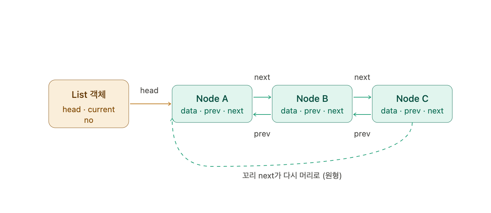

# 커서를 이용한 연결 리스트
- 연결리스트의 구현
    1. 포인터 
    2. 커서 (배열로 연결리스트 구현)
## 커서
- int형 정숫값인 인덱스로 나타낸 포인터
- 머리 노드를 나타내는 head 

## 배열 연결리스트
- 삽입된 노드의 저장 장소는 배열의 가장 끝 인덱스
- 리스트에서 n번째에 위치하는 노드가 배열 인덱스 n의 원소에 저장되는 것이 아님


## 프리 리스트
- 삭제된 레코드 그룹을 관리할 때 사용하는 자료구조
- 노드를 저장하는 곳은 프리 리스트의 머리 노드
- 프리 리스트에 빈 레코드가 등록된 경우에는 '사용하지 않는 레코드(max번째 레코드 이후의 레코드) 를 구하여 max 를 증가시키고, 그 위치에 데이터를 저장하지 않습니다. 
```=> 중간에 있는 인덱스를 재활용하기 때문에 max 값이 안 늘어난다```

## 파이썬의 논리 연산자
- x and y : x 를 평가하여 거짓이면 x 결과값 생성. 참이면 y를 평가하여 y 결과값 생성
- x or y : x 를 평가하여 참이면 x 결과값 생성. 거짓이면 y를 평가하여 y 결과값 생성
```
판단에 쓴 피연산자 그 자체(x나 y) 혹은 그 자체 판단식의 값을 돌려줌
```
- not x : x가 참이면 False, 거짓이면 True 를 생성


# 원형 이중 연결 리스트
## 원형 리스트
- 연결 리스트의 꼬리 노드가 다시 머리노드를 가리키는 모양
- 단점 : 앞쪽 노드 찾기 어려움
=> ```이중 연결 리스트로 개선```

## 이중 연결 리스트
- 데이터(data) + 앞쪽 노드(prev) + 뒤쪽 노드(next) 3개의 필드로 구성된 클래스 Node

## 원형 이중 연결 리스트
- Node 클래스: data + prev + next   ← 이중 그대로
- List 클래스: no + head + current  ← 리스트 관리용
- 특징: 꼬리 next가 머리를 가리킴(원형) + prev로 뒤로도 이동 가능(이중)

  

## 이터레이터
- 양방향으로 스캔 가능
- 이터레이터 : 순회 중 진행상태 확인 및 다음 데이터 제공
- 원형 연결리스트는 꼬리와 머리가 이어져 있어 현재 노드 위치가 머리로 돌아왔는지 체크 필요 


## 파이썬의 대입
- 값 복제가 아닌, 객체에 이름표 붙이기
```
a = [1, 2]
b = a
a.append(3)   # 객체 자체를 수정
print(b)      # [1, 2, 3] 
```
1. 값을 복제한 게 아니라 b 도 3이라는 객체 그 자체의 주소값을 가지고 있음.
2. 즉, a = 5 로 변경하면 b 도 5로 변경됨
