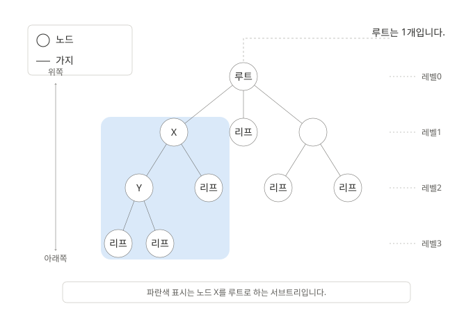

# 9장. 트리

트리는 **노드(node)** 와 **가지(edge)** 로 구성된 자료구조이다.  
각 노드는 가지를 통해 다른 노드와 서로 연결된다.

## 트리 관련 용어

### 루트(root)
트리의 가장 위쪽에 있는 노드 
하나의 트리에는 루트가 반드시 1개만 존재한다.

### 리프(leaf)
가장 아래쪽에 있는 노드로, 더 이상 가지가 뻗어나가지 않는 노드 
**단말 노드** 또는 **외부 노드** 라고도 부른다.

### 비단말 노드
리프와 루트를 제외한 나머지 노드 
**내부 노드** 라고도 한다.

### 자식(child)
어떤 노드와 가지로 연결되어 있을 때, 그보다 아래쪽에 있는 노드를 가리킨다.

### 부모(parent)
어떤 노드와 가지로 연결되어 있을 때, 그보다 위쪽에 있는 노드를 가리킨다.

### 형제(sibling)
부모가 같은 노드끼리를 가리킨다.

### 조상(ancestor)
어떤 노드를 기준으로 위쪽 가지를 따라 올라가면서 만나는 모든 노드를 말한다.

### 자손(descendant)
어떤 노드를 기준으로 아래쪽 가지를 따라 내려가면서 만나는 모든 노드를 말한다.

### 레벨(level)
루트로부터 얼마나 멀리 떨어져 있는지를 나타낸 값 
루트의 레벨은 0이며, 한 단계씩 아래로 내려갈 때마다 레벨이 1씩 증가한다.

### 차수(degree)
각 노드가 갖는 자식의 수 
트리에 속한 모든 노드의 차수가 n 이하이면, 이를 **n진 트리** 라고 한다.

### 높이(height)
루트에서 가장 멀리 떨어진 리프까지의 거리, 즉 리프가 가질 수 있는 레벨의 최댓값이다.

### 서브트리(subtree)
어떤 노드를 루트로 삼고, 그 노드의 자손들로 구성된 트리를 말한다.

### 빈 트리
노드와 가지가 전혀 존재하지 않는 트리 
**널 트리**라고도 한다.

    

## 순서 트리와 무순서 트리

- **순서 트리** : 형제 노드 사이에 순서 관계가 존재하는 트리
- **무순서 트리** : 형제 노드 사이의 순서 관계를 구별하지 않는 트리

## 순서 트리의 검색 방법

### 너비 우선 검색
**가로 검색** 또는 **수평 검색**이라고도 한다.  
낮은 레벨부터 왼쪽에서 오른쪽 방향으로 검색하며, 한 레벨의 검색이 끝나면 다음 레벨로 내려가는 방식이다.

### 깊이 우선 검색
**세로 검색** 또는 **수직 검색**이라고도 한다.  
리프에 도달할 때까지 계속 아래쪽으로 내려가며 검색하고, 더 이상 내려갈 곳이 없으면 부모 노드로 돌아간 뒤 다시 다른 자식 노드로 내려가는 방식이다.  
깊이 우선 검색은 방문 순서에 따라 다음 세 가지로 나뉜다.

#### 전위 순회(preorder)
- 노드를 가장 먼저 방문한다.
- → 노드 방문 → 왼쪽 자식 → 오른쪽 자식

#### 중위 순회(inorder)
- 왼쪽 자식에서 오른쪽 자식으로 넘어가는 중간에 노드를 방문한다. 
- → 왼쪽 자식 → 노드 방문 → 오른쪽 자식

#### 후위 순회(postorder)
- 자식을 모두 방문한 뒤 마지막에 노드를 방문한다.
- → 왼쪽 자식 → 오른쪽 자식 → 노드 방문