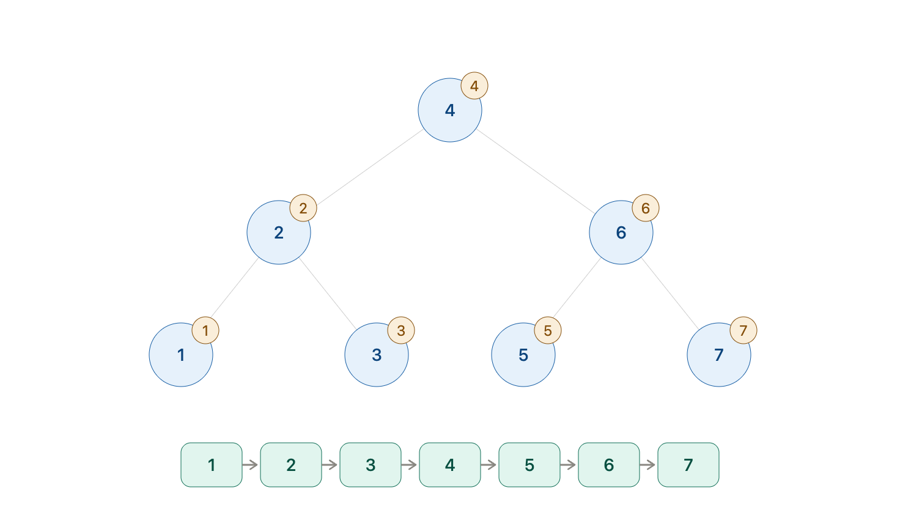

## 이진트리
- 노드가 왼쪽, 오른쪽 자식만을 갖는 트리
- 왼쪽 서브트리 : 왼쪽 자식을 루트로 하는 서브트리
- 오른쪽 서브트리 : 오른쪽 자식을 루트로 하는 서브트리

## 완전 이진 트리
- 같은 레벨 안에서, 왼쪽부터 오른쪽으로 노드가 채워져 있는 이진 트리
1. 마지막 레벨을 제외하고 모든 레벨에 노드가 가득 차 있음
2. 마지막 레벨에 한해서 왼쪽 -> 오른쪽으로 노드를 채우되 **끝까지 채우지 않아도 됨**

## 이진 검색 트리
- 왼쪽 서브트리 노드의 키값 < 자신의 노드 키값 < 오른쪽 서브트리 노드의 키 값 
- 중위순회의 깊이 우선 검색 시 노드의 키 값을 오름차순으로 정렬함

#### 이진 검색 트리 노드 검색
- 루트의 키와 검색하고자 하는 값을 비교하여 작으면 왼쪽, 크면 오른쪽으로 이동 

#### 이진 검색 트리 노드 추가
- 노드 삽입 뒤 트리의 형태가 이진 검색 트리의 조건을 유지해야 한다.
- 삽입 위치 찾고 삽입

#### 이진 검색 트리 노드 삭제
1. 자식 노드 없는 노드 삭제
- 위치 찾고, 부모 노드의 포인터 연결 삭제
2. 자식 노드 1개 노드 삭제
- 노드 위치에 자식 노드를 가져오기
3. 자식 노드 2개 노드 삭제
- 왼쪽 서브트리에서 키 값이 가장 큰 노드 검색
- 검색한 노드 삭제 위치로 옮김

#### 모든 노드를 오름차순으로 출력 
노드가 None이 아니면 
1. 왼쪽 서브트리 오름차순으로 출력
2. 노드 출력
3. 오른쪽 서브트리 오름차순으로 출력 
재귀 호출하여 반복 

#### min_key, max key
- 맨 끝인 None 을 만날 때까지 왼쪽 / 오른쪽 자식을 따라감

## 균형 검색 트리
- 이진검색트리는 키의 오름차순으로 노드가 삽입되면 트리의 높이가 깊어지는 단점.
- 높이를 O(log n)으로 제한
- 트리의 균형을 스스로 맞추도록 고안됨
1. AVL 트리
2. 레드-블랙 트리
3. B 트리
4. 2-3 트리

